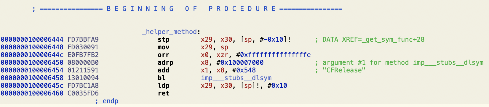
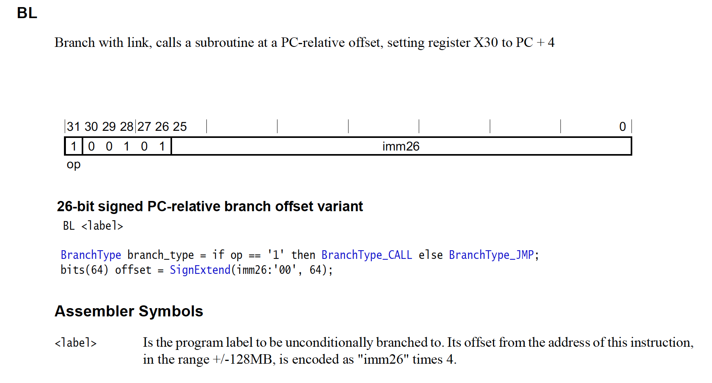

因为“众所周知的原因”，dlsym不能在运行时调用任意传入的参数，为避开这一限制，可使用如下动态查找dlsym的机制：

* 首先在代码中调用dlsym并传入一个常量字符串，如dlsym("CFRelease")，并设定调用函数的优化选项并且不支持thumb-mode，以保证跳转到dlsym的指令与helper_method的函数起始地址保持不变

```objc
__attribute__((noinline, optnone, target("no-thumb-mode"))) static void *helper_method() {
    //Will not really call this, just put here to ensure dlsym is here
    return dlsym(RTLD_DEFAULT, "CFRelease");
}
```

在arm64下，其汇编指令如下：


* 记录各个平台上helper_method与dlsym跳转指令之间的偏移（上例中为`0x100006458-0x100006444=0x14`），以便在运行时根据此数据得到跳转指令的地址（bl或call指令）

```objc
static inline uint16_t getOffsetFromHelperMethod() {
    uint16_t offsetFromHelperMethod = 0;
#if defined(__aarch64__)
    offsetFromHelperMethod = 0x14;
#elif defined(__arm__)
    offsetFromHelperMethod = 0x18;
#elif defined(__i386__)
    offsetFromHelperMethod = 0x1E;
#elif defined(__x86_64__)
    offsetFromHelperMethod = 0x12;
#endif
    return offsetFromHelperMethod;
}
```

* 根据指令地址取此指令内容，进行decode，得到dlsym目标地址相对于bl/call指令IP的偏移，并根据不同平台的换算方式算出dlsym的目标地址（此实现依赖于不同平台上相应的bl/call指令的实现）

具体实现如下：

```objc
SYM_FUNC_POINTER_TYPE get_dlsym_addr() {
    int64_t func = (int64_t)&helper_method + getOffsetFromHelperMethod();
    int64_t relative_offset = 0;
    
#if defined(__aarch64__)
    //arm64
    uint32_t inst = *(uint32_t *)func;
    uint32_t imm = fieldFromInstruction_4(inst, 0, 26);
    relative_offset = SignExtend64(imm, 26) * 4;
#elif defined(__arm__)
    //armv7
    uint32_t inst = *(uint32_t *)func;
    unsigned imm = fieldFromInstruction_4(inst, 0, 24) << 2;
    relative_offset = SignExtend32(imm, 26) + 8;
#elif defined(__i386__) || defined(__x86_64__)
    //simulator
    uint32_t imm = 0;
    memcpy(&imm, (void *)(func+1), 4);
    relative_offset = SignExtend32(imm, 32)+5; //5为此call指令的长度，目标地址是基于下条指令的地址
#endif    
    
    func += relative_offset;
    return (SYM_FUNC_POINTER_TYPE)func;
}
```


> 例：上例中指令内容为`0x13010094`，按字节序为`0x94000113`，其二进制为:
> 
> arm64平台bl指令的格式为：
> 
> 得到其pc relative offset为`0x113 * 4 = 0x44c`，则 dlsym的地址=`0x100006458` + `0x44c`


* 得到dlsym的地址后，即可通过对其传入函数名得到其他c方法地址
